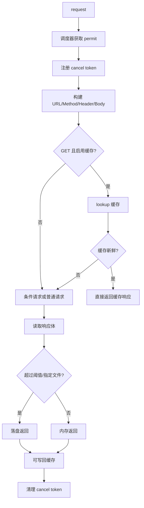
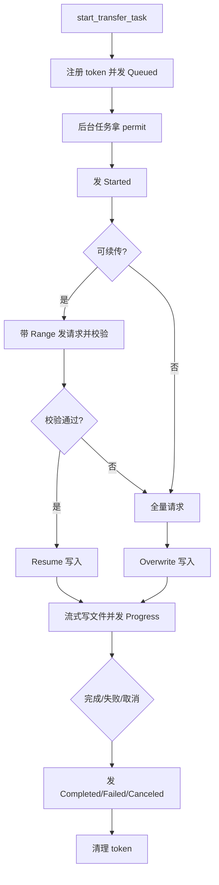

# client 模块说明

`engine/client` 负责 `NetEngine` 的核心请求与传输能力，当前按职责拆分成多个子模块，减少单文件复杂度。

## 文件划分

- `mod.rs`：模块入口、`NetEngine` 结构体与初始化构造。
- `common.rs`：公共工具方法（header 处理、可取消发送、文件目录准备、token 清理）。
- `request.rs`：普通请求链路（组装请求、缓存命中/回源、响应体内存/文件切换、缓存写回）。
- `transfer.rs`：传输任务链路（异步任务、续传协商、进度事件、文件写入）。
- `lifecycle.rs`：引擎生命周期接口（事件拉取、取消、busy 状态、清缓存、shutdown）。
- `tests.rs`：该模块的单元测试。

## 主要流程（Mermaid）

### request 链路

### transfer 链路

## 维护约定

- 通用逻辑优先放 `common.rs`，避免 request/transfer 重复实现。
- request 与 transfer 尽量只做各自编排，不互相耦合内部细节。
- 新增测试优先加在 `tests.rs`，保持行为覆盖。
